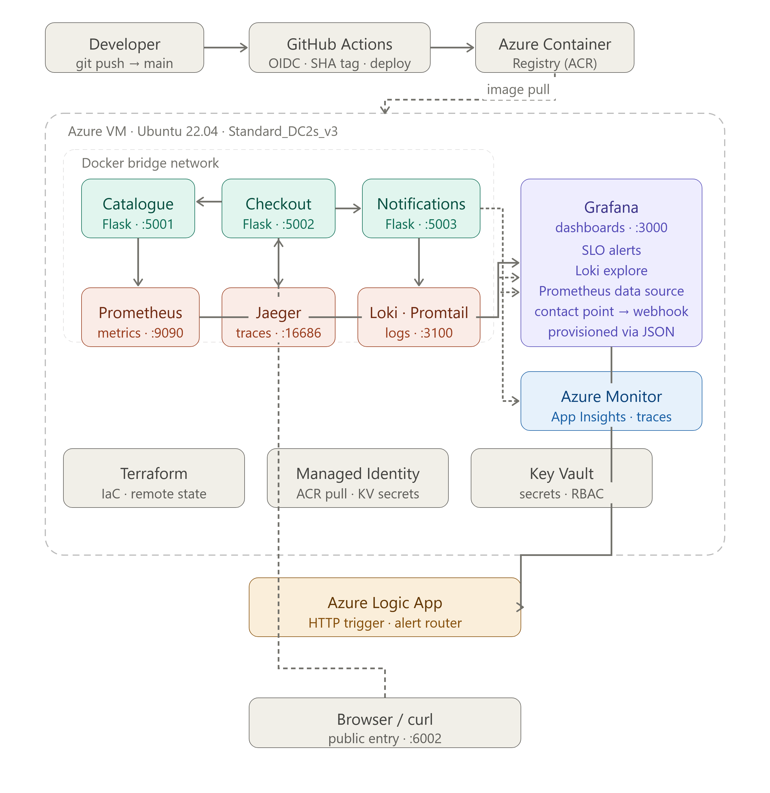
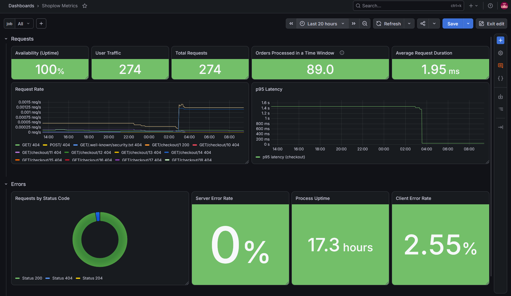
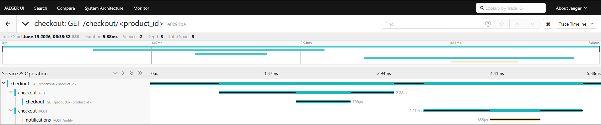
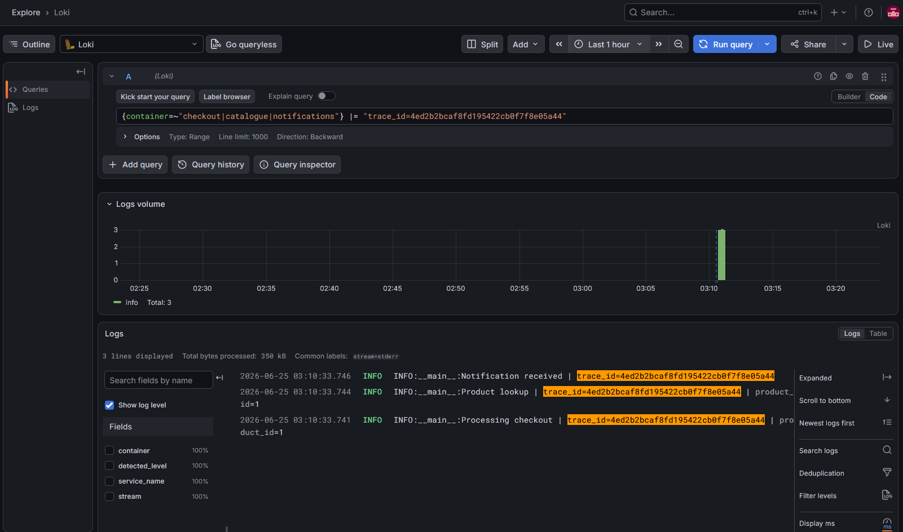
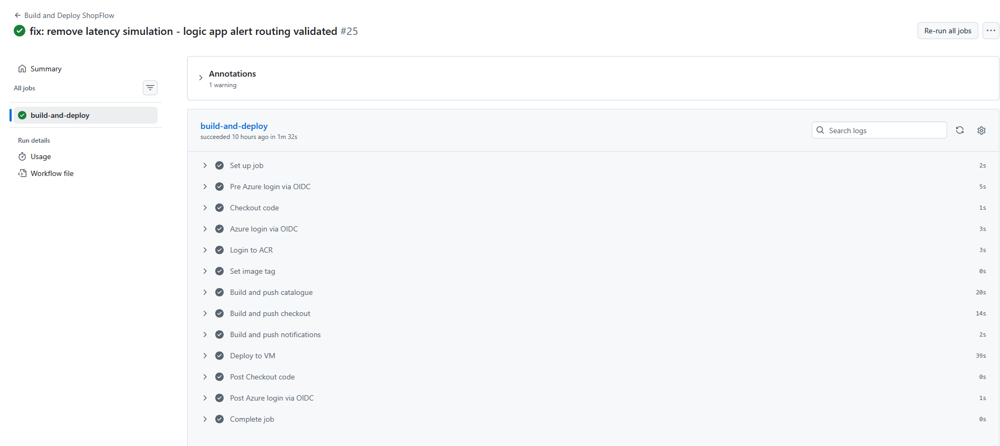
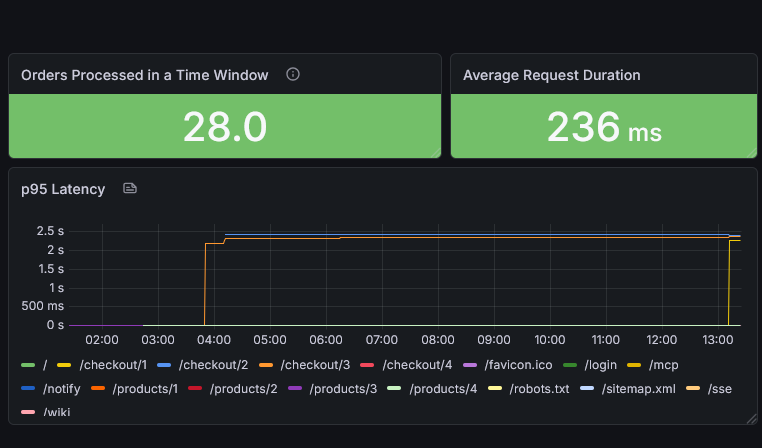
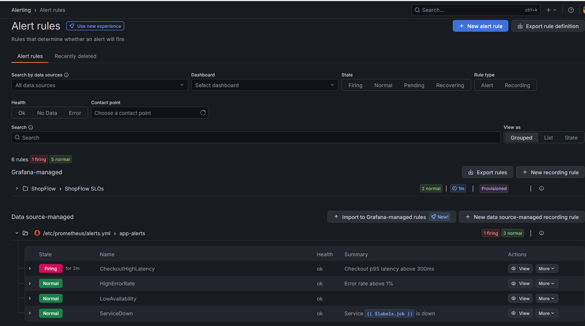
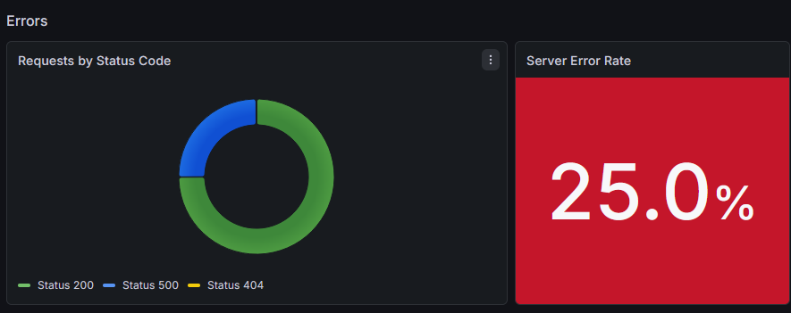
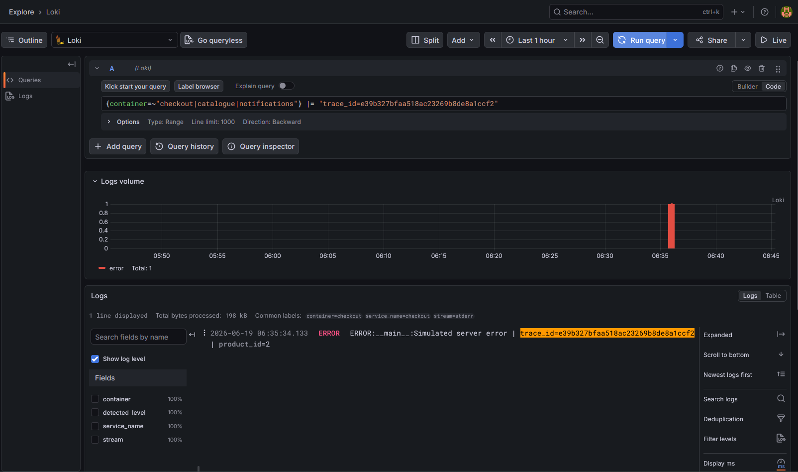
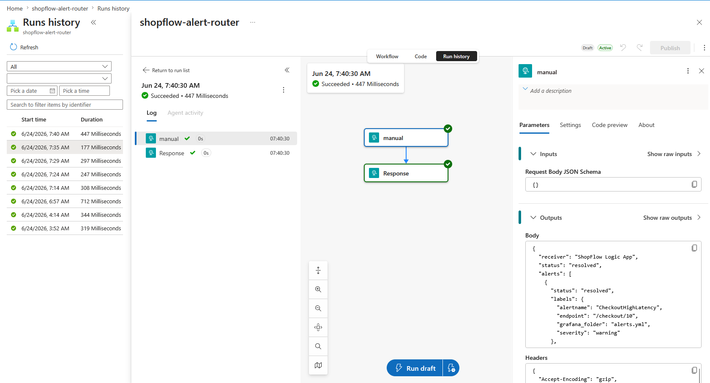

# ShopFlow Observability Platform


A production-style e-commerce backend built to demonstrate end-to-end cloud
observability, infrastructure automation, and incident response on Azure.

Three Flask microservices — catalogue, checkout, and notifications — are fully
instrumented with metrics, distributed tracing, and structured logging. The
system is deployed to Azure via Terraform, updated through a GitHub Actions
CI/CD pipeline, and monitored through a complete observability stack that
surfaces issues across all three layers simultaneously.

---

## Architecture



Checkout is the only publicly exposed service. Catalogue and notifications are
internal, reachable only within the Docker bridge network. All three services
emit metrics, traces, and logs independently — Grafana, Jaeger, and Loki
provide three distinct lenses on the same system behaviour.

---

## Tech stack

**Services**
- Python · Flask · Docker · Docker Compose

**Observability**
- Prometheus — metrics collection and SLO-based alerting
- Grafana — dashboards, alert rules, Loki data source
- Jaeger — distributed tracing (OpenTelemetry OTLP)
- Loki + Promtail — log aggregation, trace ID correlation
- Azure Monitor (Application Insights) — cloud-native trace backend

**Infrastructure**
- Azure VM (Ubuntu 22.04 · Standard_DC2s_v3)
- Azure Container Registry — image storage
- Azure Key Vault — secrets management via RBAC
- User-assigned Managed Identity — credential-free resource access
- Terraform — IaC with remote state in Azure Blob Storage
- GitHub Actions — CI/CD with OIDC federated authentication

**Alert routing**
- Azure Logic App — HTTP trigger receiving Grafana webhook payloads

---

## Local setup

**Prerequisites:** Docker, Docker Compose, Python 3.11

```bash
git clone https://github.com/haywhyogs/shopflow.git
cd shopflow
docker compose up --build
```

Services available locally:

| Service | URL |
|---|---|
| Checkout (public entry) | http://localhost:6002 |
| Grafana | http://localhost:3000 |
| Prometheus | http://localhost:9090 |
| Jaeger | http://localhost:16686 |

Test the end-to-end flow:

```bash
curl http://localhost:6002/checkout/1
```

Catalogue validates the product, checkout processes the order, notifications
receives the event. All three are visible in Jaeger as a single distributed
trace.

---

## Observability stack

### Metrics — Prometheus + Grafana

Each service exposes a `/metrics` endpoint instrumented with:

- `http_requests_total` — request count by method, endpoint, and status code
- `http_request_duration_seconds` — latency histogram with custom buckets
  aligned to the 300ms SLO threshold
- `orders_processed_total` — business metric tracking completed orders
  (checkout only)

Health and metrics endpoints are excluded from recording to prevent noise.

The Grafana dashboard covers: process uptime, total requests, user traffic,
average request duration, p95 latency, server error rate, client error rate,
availability, orders processed, request rate, and requests by status code.

Dashboard and datasources are provisioned automatically on startup via
Grafana's provisioning system — no manual setup required on a fresh deployment.



### Distributed tracing — Jaeger + OpenTelemetry

All three services are instrumented with OpenTelemetry. Traces propagate
automatically across service boundaries via HTTP headers — a single checkout
request produces a waterfall spanning all three services with per-span timing.

In addition to the open-source observability stack, traces are exported to Azure Monitor (Application Insights) using the Azure Monitor OpenTelemetry exporter. This was implemented to explore Azure-native monitoring workflows and validate that the same distributed traces could be consumed by both Jaeger and Application Insights without application code changes.

Key insight from incident simulation: trace shape (span count and structure)
is itself diagnostic. A single-span error trace immediately identifies the
failure as contained within the originating service, before logs are consulted.



### Log aggregation — Loki + Promtail

Promtail ships container logs to Loki via the Docker socket — no file path
mounting required, compatible with WSL2 and Docker Desktop environments.

Every log line includes the OpenTelemetry trace ID:

```
Processing checkout | trace_id=4ed2b2bcaf8fd195422cb0f7f8e05a44 | product_id=1
```

This enables cross-layer investigation: identify a slow trace in Jaeger, copy
the trace ID, query Loki to retrieve the exact log lines from all three
services for that specific request.



---

## SLO definitions

| SLO | Target | Alert threshold |
|---|---|---|
| Checkout p95 latency | < 300ms | Fires after 2 minutes above threshold |
| Server error rate (5xx) | < 1% of requests | Fires after 2 minutes above threshold |
| Availability | > 99.9% | Derived from error rate |

Alert rules are defined in `prometheus/alerts.yml` and evaluated by Prometheus.
Grafana alert rules with a Logic App contact point route firing alerts to Azure
via webhook.

---

## Azure deployment

### Infrastructure as code — Terraform

All Azure resources are managed by Terraform with remote state stored in
Azure Blob Storage. Resources include:

- Resource group, VNet, subnet, NSG with scoped rules
- User-assigned Managed Identity with role assignments
- Azure Container Registry, Key Vault, Application Insights
- Public IP, NIC, Ubuntu VM with cloud-init bootstrap
- Azure Logic App for alert routing

Destroy and recreate the entire environment from a single command:

```bash
cd terraform
terraform apply
```

The VM bootstraps itself on first boot via cloud-init: installs Docker,
authenticates to ACR via Managed Identity, fetches secrets from Key Vault,
clones the repo, and starts the stack.

### CI/CD pipeline — GitHub Actions

Every push to `main` triggers the pipeline:

1. Authenticate to Azure via OIDC federated credentials — no stored secrets
2. Build Docker images for all three services
3. Tag each image with the commit SHA
4. Push to Azure Container Registry
5. SSH into the VM using a dedicated deploy key
6. Pull new images and restart the stack

GitHub presents an OIDC identity token, Azure validates it, and Microsoft Entra ID issues a short-lived Azure access token for that pipeline run—eliminating the need for stored service principal secrets.



---

## Incident simulations

Both incidents were simulated on the live Azure deployment to validate the
full observability and alert routing pipeline end to end. Each followed the
same investigation workflow: Grafana surfaced the breach, Jaeger identified
where in the call chain the problem lived, and Loki provided the exact
application-level detail that traces alone cannot capture.

### Incident 1 — Checkout latency spike

An artificial delay caused checkout p95 latency to breach the 300ms SLO,
peaking at approximately 1.48s. The latency alert fired after 2 minutes.
Jaeger traces showed the delay was isolated to checkout's own span — catalogue
and notifications remained fast, ruling them out immediately. The Logic App
received the Grafana webhook payload confirming end-to-end alert routing.



A secondary finding surfaced during this incident: Prometheus's default
histogram bucket boundaries caused `histogram_quantile` to report p95 at
~2.5s despite the true maximum being 1.21s — a known limitation when bucket
boundaries don't align with the actual latency distribution. Custom buckets
were added to resolve it.



→ [Full postmortem](docs/postmortems/incident-1-latency.md)

### Incident 2 — Elevated server error rate

A 30% random failure rate on checkout requests breached the 1% error rate SLO.
Unlike the latency incident, Jaeger traces for failed requests showed a single
span with no child spans — confirming the failures occurred before any
downstream call to catalogue or notifications. This made the blast radius
immediately clear without needing to inspect either downstream service.



Loki logs for failed trace IDs showed the exact error message alongside the
absence of any product lookup or notification log lines — the detail that
completes the picture traces cannot provide on their own.



→ [Full postmortem](docs/postmortems/incident-2-errors.md)

---

## Alert routing — Azure Logic App

Grafana alert rules are connected to a webhook contact point. When an SLO
alert fires, Grafana POSTs the alert payload to an Azure Logic App HTTP
trigger. The Logic App logs each run with the full payload — alert name,
status, labels, affected endpoint, and severity — and can be extended to
route notifications to any channel (email, Teams, PagerDuty) without
changes to the alerting configuration.



---

## Key engineering decisions

**Checkout as the only public endpoint** — catalogue and notifications have no
host port mapping. Internal traffic uses Docker DNS resolution by service name.
This mirrors production patterns where internal services are not publicly
addressable.

**User-assigned Managed Identity over system-assigned** — system-assigned
identity is tied to the VM lifecycle. Deleting and recreating the VM requires
reassigning all roles. A user-assigned identity is an independent Azure
resource — role assignments survive VM recreation without intervention.

**OIDC federated credentials over service principal secrets** — GitHub Actions
authenticates to Azure via short-lived tokens issued per pipeline run. No
credentials are stored in GitHub, no rotation required.

**Prometheus alert rules as the evaluation layer** — alert conditions evaluate
at the data layer independently of whether Grafana is open. Grafana alert
rules with a contact point handle notification routing.

**Loki via Docker socket over file path mounting** — mounting
`/var/lib/docker/containers` directly is unreliable on WSL2 with Docker
Desktop. `docker_sd_configs` with the Docker socket provides reliable
container discovery across environments.

**Manual deployment before Terraform** — every resource was created manually
via Azure CLI first. The friction encountered during manual deployment directly
shaped the Terraform module structure and made every resource block meaningful
rather than copied from documentation.

**Custom histogram buckets** — Prometheus's default histogram buckets
(`1s → 2.5s`) caused significant quantile estimation error for this system's
latency distribution. Custom buckets were defined with finer granularity
around the 300ms SLO threshold, aligning the `histogram_quantile` estimate
with ground-truth trace data from Jaeger.

---

## What I'd do next

**Replace the SSH deploy key with Azure Bastion or run-command** — the current
pipeline stores an SSH private key in GitHub secrets. A cleaner approach is
`az vm run-command` scoped to a custom role granting only
`Microsoft.Compute/virtualMachines/runCommand/action`, eliminating the need
for any key material outside Azure entirely.

**Timeout and retry handling on inter-service calls** — checkout currently 
has no timeout when calling catalogue. If catalogue is slow or unavailable, 
checkout waits indefinitely. Adding a 3-second timeout with three retries 
and exponential backoff would prevent cascading failures and give users a 
fast, meaningful error rather than an indefinite wait.

**Add a message queue** — introduce Azure Service Bus between checkout and
notifications to decouple the services and make the notification flow resilient
to downstream failures. This would also add a new failure mode worth simulating
and observing.

**Staging environment** — Create a separate staging deployment that receives changes before production. This would allow automated tests and validation to run in an environment that mirrors production before promoting a release.

**SLO burn rate alerts** — Complement the current threshold-based alerts with burn rate alerts that measure how quickly the application is consuming its reliability budget. This would provide earlier warning of sustained degradation instead of only detecting hard threshold breaches.

**PostgreSQL for catalogue** — replace the in-memory product store with Azure
Database for PostgreSQL, accessed via Managed Identity. Adds a real data
persistence layer and enables more realistic read/write workload simulation.

**Logic App notification routing** — extend the current webhook receiver to
format and forward alerts to an email or Teams channel with structured message content.

---

## Project structure

```
shopflow/
├── catalogue/              Flask service — product catalogue
├── checkout/               Flask service — order processing (public entry)
├── notifications/          Flask service — order notifications
├── prometheus/
│   ├── prometheus.yml      Scrape configuration
│   └── alerts.yml          SLO-based alert rules
├── grafana/
│   ├── dashboards/         Dashboard JSON (auto-provisioned)
│   └── provisioning/       Datasource and dashboard provider config
├── promtail/               Log shipping configuration
├── terraform/              All Azure infrastructure as code
├── .github/workflows/      GitHub Actions CI/CD pipeline
├── docs/postmortems/       Incident postmortems with timelines and findings
├── images/                 Screenshots organised by feature area
├── docker-compose.yml      Local development stack
└── docker-compose-cloud.yml  Azure deployment stack
```